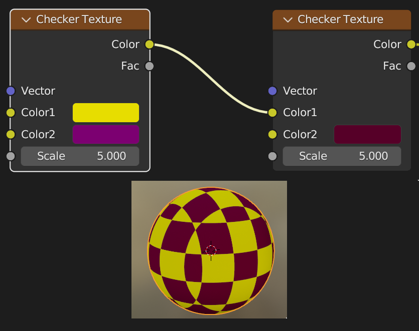
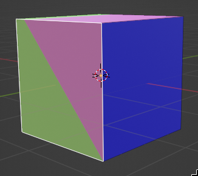

# Blender Material Shading & Texturing Workshop

## Introduction

This workshop is designed to introduce you to the basics of shading and texturing in Blender. I will be using Blender 3.5.1 for this workshop, but any version above 2.8 should be fine.

What is Material Shading ? Material Shading is the process of adding color to your 3D models. This is done by adding a material to your model. A material is a collection of properties that define how a surface should be rendered. These properties include color, texture, transparency, reflection, and more.

> Basic Shading

> Cel Shading

But before we jump in, let's do a little of theory.

Blender uses two render engines: Eevee and Cycles. Eevee is a real-time render engine, which means that it is very fast, but it is not as realistic as Cycles. Cycles is a ray-tracing render engine, which means that it is slower, but it is more realistic.  
For this workshop, we will be using Eevee.

> Some shaders will not work on Cycles

Blender does what's know as **Physically Based Rendering** (or PBR for short). This means that the shaders are based on real world materials. For example, a metal shader will have a metallic property, which will determine how much light is reflected by the surface.  
Since there is PBR, this means that there also **Bidirectional Scattering distribution function** (or BSDF for short). This is a set of function (know has the BxDF) that describe how light react when encountering a surface.

And that's it for the theory, let's jump in.

## Material

### Create a Material

I will assume that you know how you navigate through the different workspace in Blender.

So, let's head into the **Shading** workspace. You should see something like this:

> I have created an UV Sphere with a Subdivision modifier

You can see below the 3D viewport, the **Shader Editor**. This is where we will be working.

Select your **Mesh** and click on the **New** button in the **Shader Editor**. This will create a new material for your mesh. You can rename it by double clicking on the name.

> The base material

As you can see, Blender uses a Node system to create materials.

So if you did everything right, you should see something a **Material Output** Node and a **Principled BSDF** Node (how familiar).  
The **Material Output** Node is the final node of the material. It has three input:
- **Surface**: Shading for the **surface** of the object
- **Volume**: Shading for the **volume** of the object
- **Displacement**: Used to create bump mapping
The **Principled BSDF** Node is the main node of the material. It is where you will be able to change the properties of the material.
- **Base Color**: Diffuse or metal color
- **Subsurface**: Multiplier for Subsurface Radius
- **Subsurface Radius**: Average distance that light scatters below the surface. Useful for skin.
- **Subsurface Color**: Subsurface scattering base color.
- **Subsurface IOR**: Index of refraction for Subsurface scattering. (Cycles Only)
- **Subsurface Anisotropy**: Anisotropy of Subsurface scattering. (Cycles Only)
- **Metallic**: How much the surface is metallic.
- **Specular**: How much the surface is specular.
- **Specular Tint**: How much the surface is tinted by the base color.
- **Roughness**: How rough the surface is.
- **Anisotropic**: Amount of anisotropy for specular reflection. (Cycles only)
- **Anisotropic Rotation**: Rotation of anisotropy for specular reflection. (Cycles only)
- **Sheen**: Amount of soft velvet like reflection near edges, useful for Cloth-like Material.
- **Sheen Tint**: Tint of sheen reflection.
- **Clearcoat**: Extra white specular layer on top of others.
- **Clearcoat roughness**: Roughness of clearcoat specular layer.
- **IOR**: Index of refraction for transmission.
- **Transmission**: How much light is transmitted through the surface.
- **Transmission Roughness**: Roughness of transmission. (Cycle only)
- **Emission**: Light emission from the surface.
- **Emission Strength**: Strength of emission.
- **Alpha**: Transparency of the surface.
- **Normal**: Controls the normal of the surface.
- **Clearcoat Normal**: Controls the normal of the clearcoat layer.
- **Tangent**: Controls the tangent of the anisotropic layer.

Node inputs and outputs have **Type** represented by color, meaning that you would generally want to connect a yellow output to a yellow input, if the connection is not possible, the link will be red, but sometimes, even if the color doesn't match, you will be able to connect them.

### Change the color

You've guessed it, changing the base color is as simple as changing the **Base Color** property of the **Principled BSDF** Node.

I will let you play yourself with the other properties and see how your material react.

---

## Procedural Material

Procedural Material is a kind of material that is generated using only generated texture or noise. This means that you don't need to use an external texture to create those materials.  
These materials gains a lot against textured material because there are resolution independent, but they can get really heavy for you computer, so do not abuse them.

### Adding a Node

To add a node, you can either press <kbd>Shift</kbd> + <kbd>A</kbd> or right click and select **Add**.

Since there is a lot a submenu, I will indicate where you can find the node when you will need it.

### Checker
:blue_book: **Texture** > **Checker Texture**  

Blender has a built-in checker Texture, so this Material will not be hard to create.  

Let's break down the node tree:
- **Color1** and **Color2** are the two colors of the checker
- **Scale** is the scale of the checker
- **Vector** is the vector of the checker
- **Vector** is the *Texture Coordinate* to sample the texture

> Texture Coordinate ?

### Texture Coordinate
:blue_book: **Input** > **Texture Coordinate**  

The **Texture Coordinate** Node is a node that gives you the coordinate of the surface.

As you can see, this node have no inputs, only outputs. This is why it is called an **Input Node**, because this Node will only at the input of other node

- **Generated**: This is an automatically generated coordinate system that is based on the bounding box of the object. This means that the texture will be projected on the object.
- **Normal**: Object space normal vector.
- **UV**: UV map of the object.
- **Object**: Uses an object to define the coordinate system.
- **Camera**: Position coordinate in camera space.
- **Window**: Position coordinate in screen space.
- **Reflection**: Uses the direction of the reflection vector as coordinates

---

Back to our Checker Texture, by default, Texture Node are set to Generated, this will be enough for our checker texture.  
- **Color** is the color of the checker texture
- **Fac** is the factor of the checker texture

So let's connect our texture to our material, to do so, we will simply connect the **Color** output to the **Base Color** input, you can also use the **Fac** output, but it will be black and white.

A simple way to customize your result is by plugin the **Fac** output into another input of the **Principled BSDF** Node. For example, you can plug it into the **Metallic** input, and then by tweaking with the **Roughness** and **Specular**, you can obtain this.

> You can use the Texture Coordinate to see what other Texture Coordinate looks like.

Another way to customize your result is by plugin a **Checker Texture** output into another **Checker Texture** input.

> Huuh, where is my third color ?

This is because our first texture gets overwritten by the second one. There plenty of way to fix this, but for now I will simply just tweak the scale of the second texture.

Okay, enough with the checker, let's play with a more simple and yet powerful texture.  
The **Noise Texture**.

### Noise Texture
:blue_book: **Texture** > **Noise Texture**

The **Noise Texture** is a texture that is generated using a Perlin noise.

- **Scale** is the scale of the noise
- **Detail** is the detail of the noise, lower value means less detail (more blurry)
- **Roughness** is the roughness of the noise, lower value means less roughness (more smooth)
- **Distortion** is the distortion of the noise

Plugin the **Color** output in will give you something like this.

> Play with the values and see what happens

So, how can we use this texture to create something interesting ?  
Well, with only this texture, we will not go far. But if we combine this with other Nodes, we can create something interesting.

> Yes, this is just a Noise Texture, look kinda like a marble, right ?

This Material is actually really simple, but to understand it, we will need to talk about **Color Ramp**

### Color Ramp
:blue_book: **Converter** > **Color Ramp**

The Color Ramp is a Node that allows you to map values to colors using a gradient.

- **Fac** is the factor of the color ramp
- **Color** is the color output of the color ramp
- **Alpha** is the alpha output of the color ramp

The Color Ramp is a really powerful Node, allowing to obtain various effect from Masking to Recoloring.

So, how does it work ?

You probably have seen the color gradient in the middle, this is where you can add and move *color stops*, they are the little black and white markers, these stop will change the aspect of the ramp, and so the output.

You can also change the interpolation of the color stops, by default, it is set to *Linear*, but you can change it to *Cardinal*, *Constant*, *B-Spline* or *Ease*.  
Now you can play with it and try to understand how I created the Red Marble.

### Bumping

Bumping is a technique that allows you to create the illusion of depth on a surface.

> Just a Noise Texture

To add some bump, let's call our new Friend, the **Bump Node**.

### Bump
:blue_book: **Vector** > **Bump**

The **Bump Node** will generate normals based on a Height map.

- **Strength** is the strength of the bump (0.0 -> no bump, 1.0 -> full bump)
- **Distance** is a multiplier for the height value, control the overall bump result
- **Height** is the height map
- **Normal** is the normal map

- **Invert** inverts the bump, this will make the bump effect go inside the surface instead of outside

- **Normal** is the normal output of the bump node

To use it, you just need to plug the **Normal** output into the **Normal** input of the **Principled BSDF** Node...  
...and if your Mesh is just flat, that's normal, we need to plug something into the Height input.  
We will just use our old friend, the **Noise Texture**.
> **Fac** or **Color** output ? Actually, they both work, so you can use the one you prefer.

If you got something like the image above, this mean that you did great, and we can start to play with it a little.

Now, we can use another of our friend, the **Color Ramp**.  
> A Color Ramp ? For what ?  

Yes, a Color Ramp does sound pretty useless for bumping, but it is actually really useful.

But first, add some detail to the **Noise Texture**, just about 16 should be enough.

So now, add a **Color Ramp** between the **Noise Texture** and the **Bump**, at first, this should not change a thing, but if you move the white stop to the left...

... the Bump look like it has been clamped.  
Well actually, this is only because we have reduced the range of the **Noise Texture** with the Ramp.  

With this in mind, we can now create interesting material.

> Can you do it ?

Okay, now you know the basics of Procedural Material, so I will let try to do something by yourself.  
Don't be afraid of using another Texture, you can obtain interesting texture with the **Voronoi Texture** for example.  
You can go on [Blender 3.5 Manual](https://docs.blender.org/manual/en/latest/render/shader_nodes/index.html) to see what other Nodes do.  
You can also try to look on the Internet for some inspiration, ***no cheating***.

---

## Texture

Now that you know how to create, let's see how we can use **Textures**.

### Image Texture

**Image Texture** is a texture that is based on an image.

- **Vector** is the vector of the texture, by default, it will be using the **UV map** of the object.

- **Image** is the image that will be used by the texture
- **Interpolation** is the method to scale the image
    - **Linear** default mode, regular quality interpolation
    - **Cubic** high quality interpolation
    - **Closest** no interpolation, pixelated result
    - **Smart** use **Cubic** when scaling up and **Linear** when scaling down (Cycles only)
- **Projection** is the projection of the texture
    - **Flat** uses the XY coordinates for mapping
    - **Cube**
    - **Tube**
    - **Sphere**
- **Extension** defined how the image is extrapolated past the original bounds
    - **Repeat** the image is repeated
    - **Extend** repeat the pixels on the edge
    - **Clip** clip to the original size
    - **Mirror** flip the image at every repeat
- **Color space** type of color space used by the image
- **Alpha** if the image has an Alpha Channel, you can choose how it is encoded in the image.

- **Color** is the color output of the texture
- **Alpha** is the alpha output of the texture

So, let's take an Image, you can add an image by clicking on the **Open** button in the **Image Texture** Node, or you can drag&drop an Image from the **File Explorer** on the right.  
I will use this Image for this example.  

So let's plug the **Color** output into the **Base Color** input of the **Principled BSDF** Node.

Depending on your image and your **Mesh**, you will have different result.  
If you used my sphere and my image, you should have something like this.

> Reimu on a ball

Feel free to play with the properties of the **Image Texture** Node to see what happens.

### UV Mapping

So our Reimu is kinda of stretched, this is because the **UV map** of the sphere.  
But what is an UV map ? Time for some theory.

An UV map is a 2D representation of a 3D model. It is used to map a texture to a 3D model.  
You might have seen this kind of image before.

This is a regular Texture, UV mapping consist of saying that a Vertex in space, will use a specific position on the texture.  
For simplicity, I will now use a Cube as a **Mesh**, and you should do so too.  
I will also uses this texture for the explanation.

If you just plug this Image, you will probably get something like this.

You've guessed it, this is not what we want, the objectif is to have each color on each face of the cube. Something like this:

To get this, we need to change the **UV Mapping** of our cube. To do so, let's go to the **UV Editing** Workspace

On your left, you should see the **UV Editor**, this is where we will be editing our UV map.  
On your right, you should see the **3D Viewport**, this allow us to edit our **Mesh** and map the UV map to it directly.  
I recommend you to go into **Material Preview** mode, this will allow you to see the result of your UV mapping without going back to the **Shading** workspace.

On the **UV Editor**, you should see some Vertex, Edge and Face (if you don't, select your Cube in the Viewport).

This represent our **Mesh** unwrapped onto the **Texture**, this will be helpful to see how our **Mesh** is mapped to the **Texture**.

Let's start editing then, first select a Vertex and **Move** it.
> You should normally have a **Tool** bar on the left (press <kbd>T</kbd> if you don't), this work just like the **Tool** bar in the **3D Viewport**.

You should see the texture on your **Mesh** being modified.

So this is great, but we might run into a problem. Let's map a Face correctly.

Okay, we've got the blue face, but the other face has definitely some issues.  
> We just need to map the other face, right ?

Well nope, this is because our **Vertex** are linked together, meaning that when we moved one **Vertex**, the other one moved too.

> Huh ? There is a Face missing !

Actually, the face is still there, but it's more like a line now, let me show you.

See ? The Vertices are just aligned, so the UV Mapping is just a Line, giving us this effect.

But how can we fix this ?

Well, for now we have selected our **whole** cube, meaning we will edit the **UV Map** of all the **Vertex** at the same time, but remember that we have a **3D Viewport** on our right, and we can select only a face...

... giving us...

... only the Vertices of this face.

That way, we can edit the UV Map of this face without affecting the other faces.

So, you can move the Vertices to another face and...

... fixed !

I think that you understood the basics, so I will let you finish the work on your own.  
Don't hesitate to ask for help if your stuck.  

---

## Advanced Shading & Texturing

In this part, we will learn how to use different material on a single Mesh and how to use multiple UV Maps.

### Multiple Material

So, let's say that I got this Mesh.

> Pretty fancy right ?

I want to have a stripe of another color in the middle of the band, but I don't want to create a Texture just for that.  
And if I wanted to use a procedural material, I wouldn't work.

So, our solution here is to use **Multiple Material**.

Let's head into the **Shading** Workspace first.  
And now look at the Property Tab (on your right), you should see something like this.

You will probably recognize the New Button, this will create a default Material for your Mesh.  
But pay attention to the section above. This is a List of all the Material for your **Mesh** (for now it is empty since there's no material), you might have seen the :heavy_plus_sign: and the :heavy_minus_sign:, these allow you to add and remove Material from the list.  
Enough talk, let's try it out.  

You can create a default material, this will be our first material.  
Then, click on the :heavy_plus_sign: to add a new material and create a new one, this will be our second material.  
Now, select the **Mesh** and go into **Edit Mode**.  
> You can press <kbd>Tab</kbd> to go into **Edit Mode**.

Now, select the face where you want to apply the second material, and if you look into the Property Tab, a new section with 3 Button should have appeared as soon as you entered **Edit Mode**. 

if you okay with the face you have selected, then just select your material in the list and click on **Assign** and voila.

### Multiple UV Maps

Multiple UV Maps are useful when you want to use multiple texture on a single Mesh, or to compute two shading along 2 different UV maps.

Let's head into the **UV Editing** Workspace.  
If you look again at the Property Tab, you should see something like this.

This is the **Mesh Data** tab, this is where you can edit the data of your **Mesh**.  
If you look closely, you should see a section named **UV Maps**, this is what we're looking for.  
Simiraly to the **Material** tab, you can add and remove UV Maps.
Now, you know how to handle a UV Map, so I will just show you how to can use them in the **Shading** Workspace.

Meet your new friend, the **UV Map** Node.

  
> :blue_book: **Input** > **UV Map**

- **From Instancer** (Cycles only)
- **UV** the UV map to use

- **UV** the UV map output

To use it with the **Image Texture** or other **Texture**, just plug the **UV** output into the **Vector** input of the **Texture**.

If you understand pretty well, you could obtain things like this.

---

And that's it for this Workshop, I hoped you liked it, and if you have any questions, feel free to ask.
